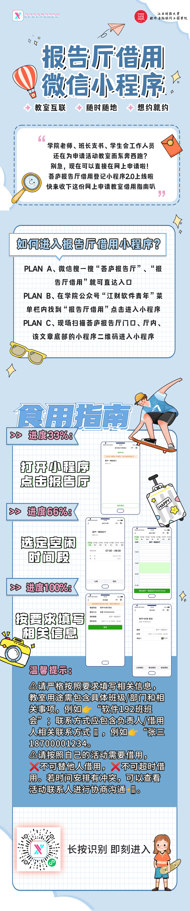

江西财经大学软件与物联网工程学院报告厅预约登记小程序（[原项目：开源会议室](https://github.com/007gzs/meeting)）

报告厅预约小程序+Django服务端后台，修改自[原项目](https://github.com/007gzs/meeting)，以适应学院需要。

## 扫码体验

## 安装方式

详见[原项目介绍](https://github.com/007gzs/meeting)

## 更新日志

### V1.0 2020年12月

初始版本，修改原项目以适应学院需要，部署在腾讯云轻量应用服务器（2核4G5M）：

固定仅一个教室，默认所有用户都有这个教室（数据库中设定触发器，当有新用户时自动绑定教室，即关注）

修改时间间隔为5分钟

删除参与者功能

添加预约描述

删除分享、二维码功能（二维码功能一直失效）

删除创建教室入口

### V2.0 2021年11月10日

服务器迁移至校内服务器（8核16G200M）

关闭websocket连接功能（原来应该是用来测试连接的，由于现在网络速度和服务器处理速度已经非常可观，不需要显示加载中了）

平均接口响应速度从400ms降到80ms

同步更新原项目代码

### V2.0.1 2021年11月11日

开放分享功能

### V2.0.2 2021年11月12日

增加公告提醒功能

### V2.0.3 2021年11月13日

修改部分文案，新小程序正式上线

### V2.0.4-2.0.6 2021年11月15日

修复bug，删除一个不必要请求的api（每次打开都会请求创建教室接口，删除之），减少60ms左右的打开响应时间

删除预约界面发起人，因原微信接口变动，无法获取发起人微信头像和昵称

项目上传至GitHub

## 正在路上

- [ ] 适配黑暗模式
- [ ] 更换新UI
- [ ] 修复授权，获取发起人头像和昵称
- [x] 连接速度进一步优化

